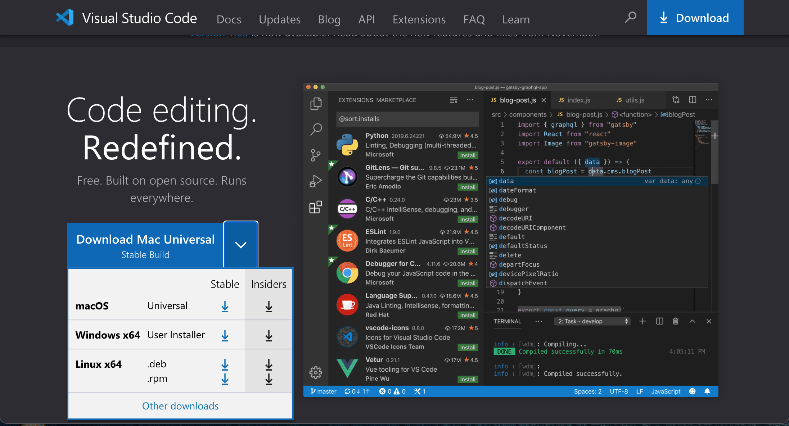
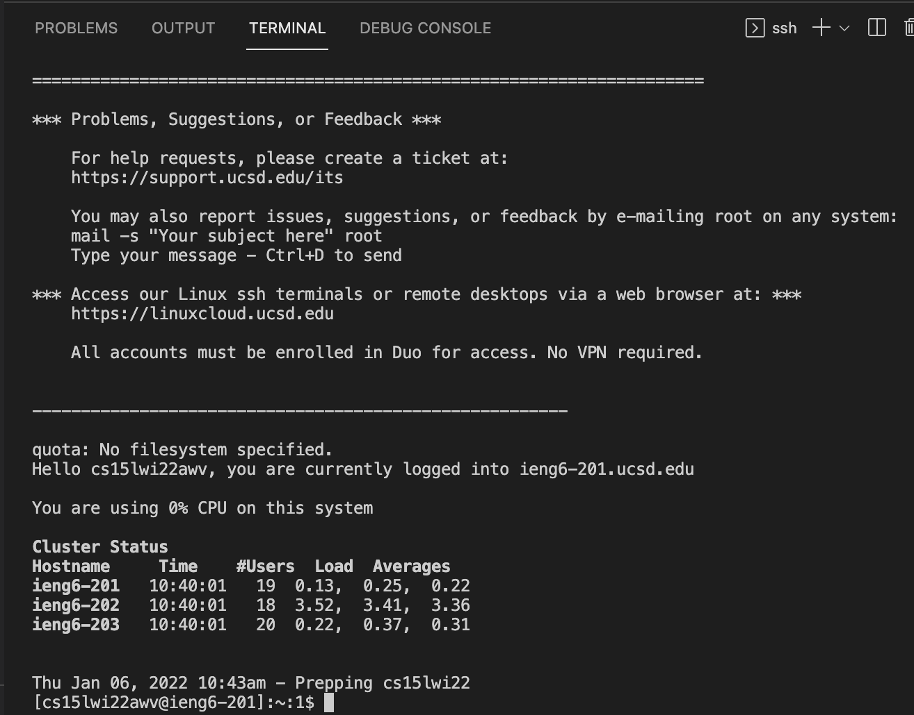
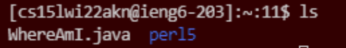
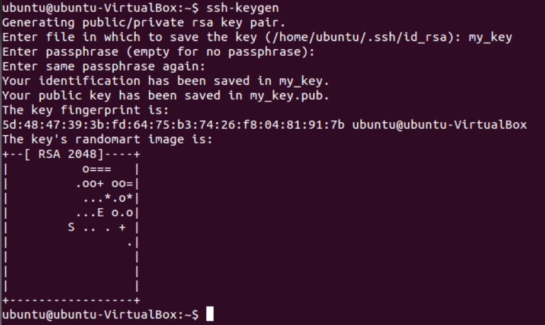
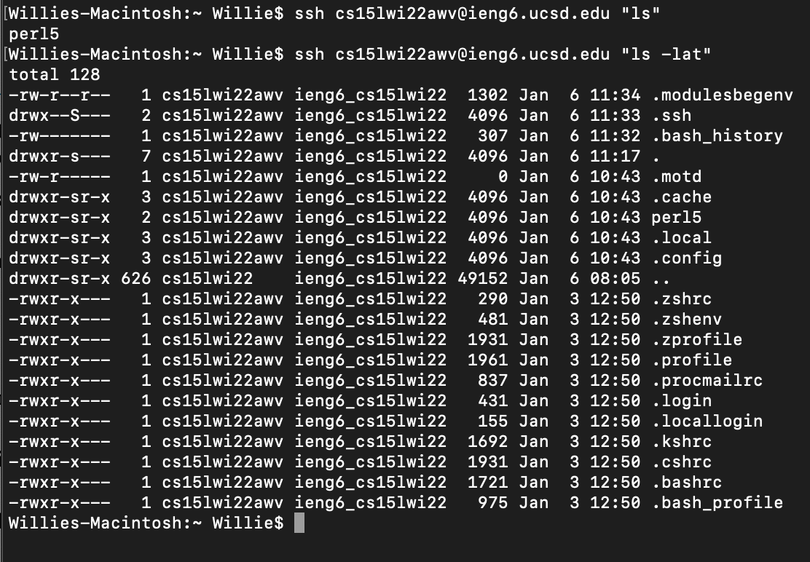

# Part 1: Installing VScode

The first step is to instal VScode from this website: 
[Install VScode](https://code.visualstudio.com/)

As seen in the picture above, download the VScode that corresponds to your computer operating system. (macOS for Macs and Windows x64 for PCs)

**NOTE: VScode does not support chromebooks or tablets**

# Part 2: Remotely Connecting

Once VScode is downloaded we can access the terminal in it.

———————————————————————————————————————————

**NOTE: Windows users need to install a program called OpenSSH**
- Install here: [Open SSH](https://docs.microsoft.com/en-us/windows-server/administration/openssh/openssh_install_firstuse)
- then look for you specific cse15l account here: [ucsd account](https://sdacs.ucsd.edu/~icc/index.php)

———————————————————————————————————————————

You can press control + \` or command + ` to open a terminal in VScode (alternatively you can go to Terminal and then New Terminal).
To access the remote ieng6 server you type in the following command 

`$ ssh cs15lwi22zz@ieng6.ucsd.edu`

with the `zz` being replaced by your specific account letters.

You will get asked to put in your password and once you do your terminal should look like the image below… 

Now you are good to go and start commanding!

**to log out at any time you can press control + D or type in exit**

# Part 3: Trying Some Commands

Try to run some commands now that you are connected to the remote servers.
Here is a list of commands to try… 

- `cd`
- `ls -a`
- `ls -lat`
- `pwd`
- `mkdir`
- `cat`
- `cp`

When `ls -a` is typed as a command this lists all the files in the directory in which you are currently in 

# Part 4: Moving Files with scp

A useful command is `scp` which is used to copy a file or multiple files from your computer to a remote one. 

To move a file from your computer to a remote one we would use the following syntax… 

`scp  ____name of file to copy____   ____cs15lwi22zz@ieng6.ucsd.edu:~/____`

with the `zz` replaced by your specific account letters.

You will be asked to enter your password and one entered the file should be copied to the remote account. 
(To verify that the file is in the remote account log into the remote server using ssh and type in ls command, you should see the file there; in the picture below the file copied is named WhereAmI.java)

# Part 5: Setting an SSH Key

We can use ssh keys to avoid retyping your password every time we connect to the remote ieng6 server. To do this run the command `ssh-keygen` on your (client) computer. Then you will be prompted with the following …

Now log in to your remote ieng6 server account using

`ssh cs15lwi22zz@ieng6.ucsd.edu` 

with `zz` replaced by your account specific letters.
Once logged in run command `mkdir .ssh` then log out.
Now on your computer terminal run the command....

`scp /Users/user/.ssh/id_rsa.pub cs15lwi22@ieng6.ucsd.edu:~/.ssh/authorized_keys`

(You use your username and the path you saw in the command above)

Now you can ssh or scp from your computer to the remote one without using a password.

# Part 6: Optimizing Remote Running

To run commands on the remote server from your computer you can write the command in quotes. For example typing… 

`ssh cs15lwi22@ieng6.ucsd.edu "ls -lat”`

will display all the files in the home directory of the remote server and the time they were crated. 

Notice how we are still in our own terminal and not the remote server’s.

You can also type in multiple commands using a semicolon like the example below… 

`ssh cs15lwi22@ieng6.ucsd.edu "ls -lat; cd ~; pwd; ls”`

We can save multiple keystrokes especially if we want to re run any program. For example this command would run a program when first typed...

`./HelloWorld.java`

typing that involved 16 total keystrokes. Each time we want to re run to program we would have to type in all of it again. We can save keystrokes though by simply using the arrow keys specifically the up arrow key. This will allow for us to cycle through old commands and since the command above was the last command entered we simply press two keystrokes to re run the program. This cuts down 15 keystrokes to just two. (pressing enter counts as a keystroke).
