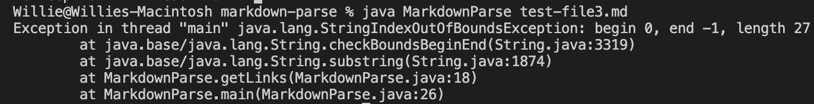

# Week 4 Lab Report 2 - CSE15L

## Change 1

*Output to terminal before fix* 

*Picture of code fix*

*[Link to test file](https://github.com/wgascarosas/markdown-parse/blob/main/test-file3.md)*

*Analysis of fix:*
The bug here threw an out of bounds exception. File 3 contains no links at all just two brackets and some text, this is why the exception was thrown. To fix this we need to add statements that deal with the instance where no links are prvided inside regular parenthesis. The if-statement does just that and returns an null list when no link is provided. 

## Change 2

*Output to terminal before fix* 

*Picture of code fix*

*[Link to test file](https://github.com/pz2105/markdown-parse/blob/main/lab2_thirdTestFile.md)*

*Analysis of fix:*
For this bug it was more tricky to fix. The bug here is that the program cannot really distinguish between the actual starting point of a link. This is why it prints out part of the description within the link. To fix the problem we need to check if a "(" comes after a "]".

## Change 3

*Output to terminal before fix* 

*Picture of code fix*

*[Link to test file](https://github.com/wgascarosas/markdown-parse/blob/main/test-file6.md)*

*Analysis of fix:*
When involving test file 6, we did not get any error, there was simply a printed out statement (`[page.com]`). Here the program thought the image inside the brackets was a link. To fix this we weould need to add if else statement to check if the first character is a "!". If so the image will be skipped over which is what we want.