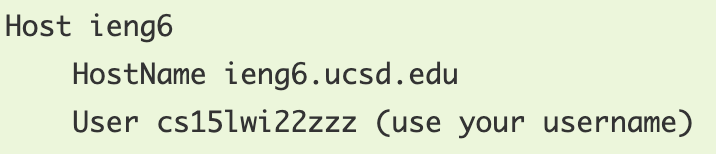
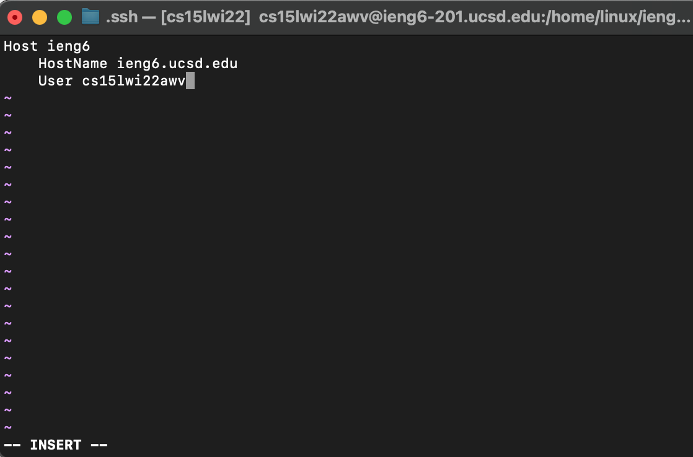
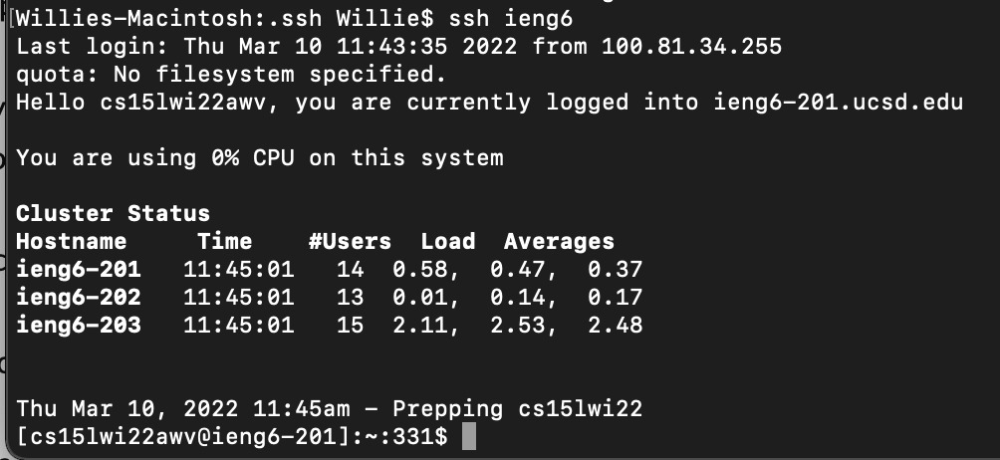
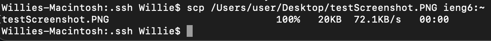
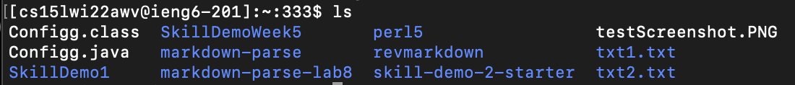

# Week 6 Lab Report 3 - CSE15L

## Streamlining ssh Configuration
Logging into a remote server with a long username can be very annoying at times. SHH has a unique feature to make this process easier. We can make/edit a Config file to tell SSH what username and password to use when logging into the remote server for this class specifically the ieng6 server. 

### Step #1: Making and Editing the Config file
In order to make or edit the Config file we have to access the `~/.ssh/config` directory. If the file does not exist we can create it using `touch`. To edit the file we can use a coding IDE or edit it in vim which I will be doing. Simply stype in `vim config`. To go to insert mode we type in "i" and now we can type or paste the code snippet below. 

Here is the code in the Config file...

To save the file type ":wq" and this saves the Config file.

### Step #2: Make sure it works
Now that we configerred the file instead of typing 
`ssh cs15lwi22zzz@ieng6.ucsd.edu` 
each time we can simply type `ssh ieng6`.

As you can see we successfully logged in to the ieng6 remote server in this more convenient way.

### Step #3: Using "scp"
This new nickname can be used along with the `scp` command not just `ssh`. In order to test it out the command would work the exact same just replacing the long username with ieng6.

When we log into the remote server we can see the Test Screeenshot successfully got copied to the remote directory.
