# Week 8 Lab Report 4 - CSE15L

## Links
- *[my markdownparse](https://github.com/wgascarosas/markdown-parse)*
- *[reviewed markdownparse](https://github.com/w2llS/markdown-parse)*

# Snippet 1
Using *[this](https://github.com/wgascarosas/markdown-parse)* cite, Snippet 1 should produce the following... 
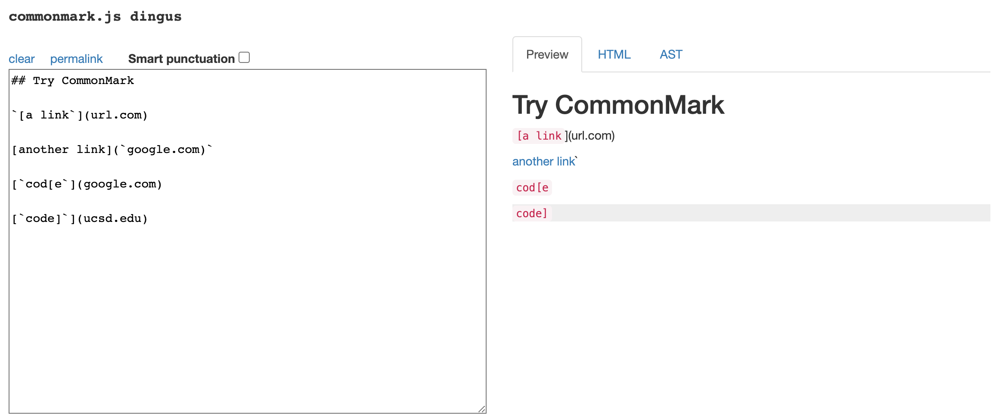

**Testing**
From the code produced above we can see that only one link gets produced. This corresponds to *another link* contaning *'google.com*. 
Here is the test I implemented...
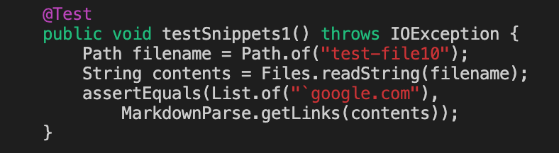

Here are the results when ran with my markdownparse
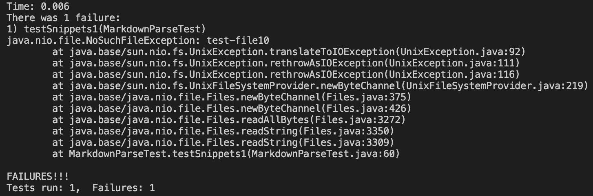

Here are the results when ran with the reviewed markdownparse
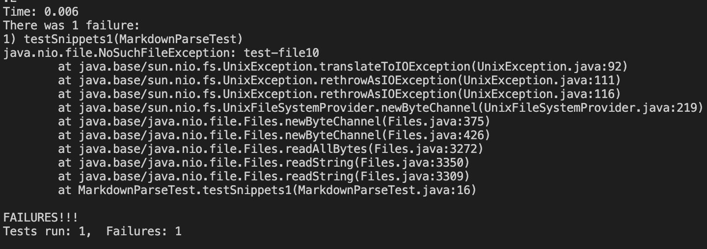

# Snippet 2
Using *[this](https://github.com/wgascarosas/markdown-parse)* cite, Snippet 2 should produce the following... 
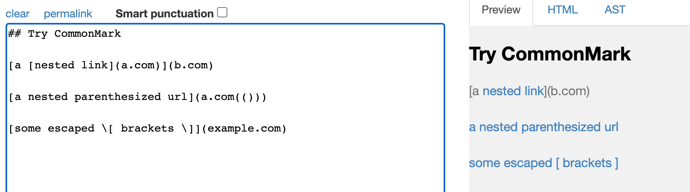

**Testing**
From the code produced above we can see that three links gets produced. This corresponds to *nested link* contaning *a.com*, *a nested parenthesized url* contaning *a.com(())*, and *some escaped [ brackets ]* contaning *example.com"*.
Here is the test I implemented...
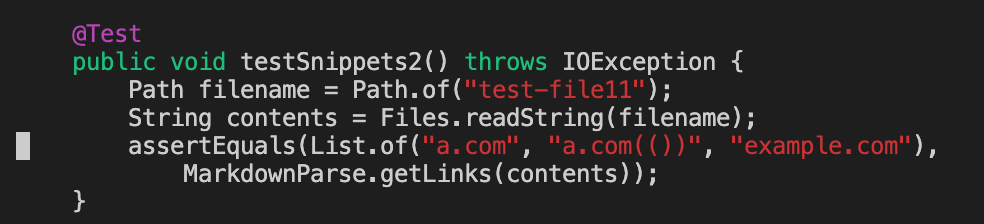

Here are the results when ran with my markdownparse
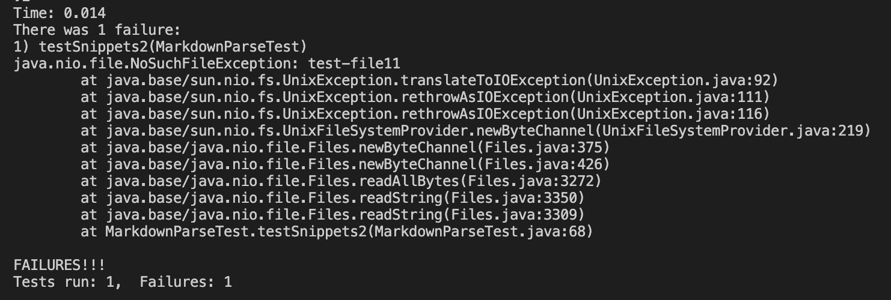

Here are the results when ran with the reviewed markdownparse
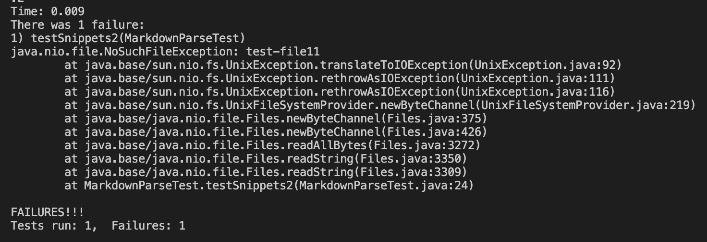

# Snippet 3
Using *[this](https://github.com/wgascarosas/markdown-parse)* cite, Snippet 3 should produce the following... 
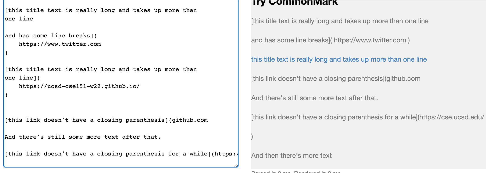

**Testing**
From the code produced above we can see that only one link gets produced. This corresponds to *this title text is really long and takes up more than one line* contaning *https://ucsd-cse15l-wi22.github.io/*. 
Here is the test I implemented...
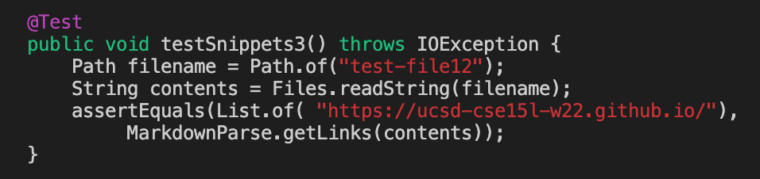

Here are the results when ran with my markdownparse
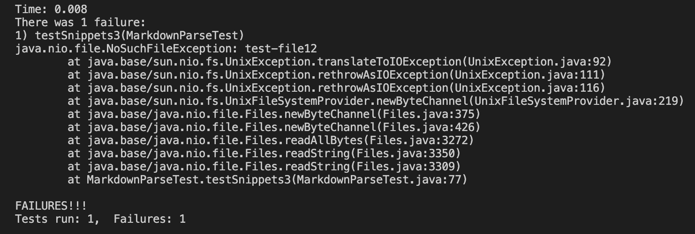

Here are the results when ran with the reviewed markdownparse

