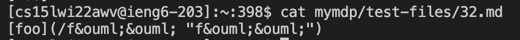
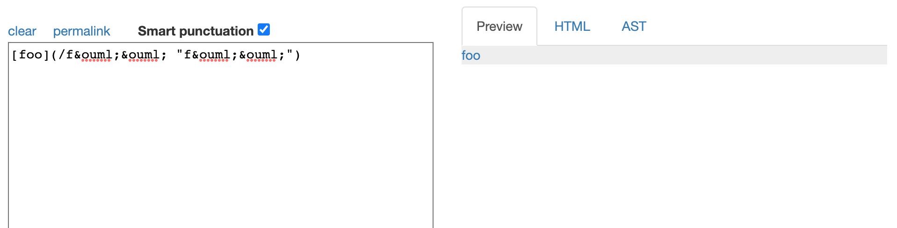
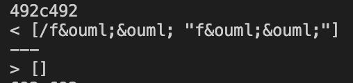

# Week 10 Lab Report 5 - CSE15L

- *[my markdownparse](https://github.com/wgascarosas/markdown-parse)*
- *[shared markdownparse](https://github.com/ucsd-cse15l-w22/markdown-parse)*

## Finding Tests with different Results
In order to find the list of files with different results we will take advantage of the `diff` command in SSH. We first needed to copy all the contents of test-files into a results.txt file to make it easier to work with. In order to do this we compile the program then run ... 

`bash script.sh > results.txt`. 

This creates a text file named "results.txt" and copies to output of `bash script.txt` to it. The output is all the file names and their corresponding outputted link.

We did this process in the shared markdownparse as well as in my own markdownparse. Now with both txt files created we can compare the two with the `diff` command. We can run the following... 

`diff student-mdparse/results.txt markdown-parse/results.txt`

...replacing student-mdparse with your corresponding markdownparse directory and markdown-parse with the shared markdownparse directory in your computer. This will display the lines where there are differences in each file. Here is a snippet of what it should look like essentially. 

In the pic above for the first difference, "212" refers to the line number where theses differences occurs. In my markdownparse results.txt (student-mdparse/results.txt), the line 92 contained `[]`, while on line 92 of the shared results.txt in the markdownparse directory (markdown-parse/results.txt), the line contained [url]. 

To figure out exacty which md file is causing the difference we go to either results.txt file (one ways is with with `vim results.txt`) and go to that exact line. The .md file appears ontop of that line. We can then use `cat` to print out the contents of the .md file to see where exactly the problem is. The following are two test files that have differences in how they recognized their contents.

## Test #1
### File 487.md
Here are the contents of the file "487.md".

Here is the expected output according to the [Common Mark](https://spec.commonmark.org/dingus/) website.

Here is the result when `diff` command is run with both result.txt files.

As you can see in my markdownparse the output is `[my/uri]` while the output for the class shared markdownparse does not recognize the file as a valid link thus having no output (`[]`). 

The correct implementation is the one where no link is found. Here the bug is that my markdownparse recognizes "/my uri" as a link. This is not the case as this would link to a file called my uri in my computer under the path "/Users/user/Documents/GitHub/cse15l-lab-reports/mylink". Since there is no file with that name there there should not be a link produced. In order to fix this issue we would need an if statement to catch any "/" in files and ignore them.

## Test #2
### File 32.md
Here are the contents of the file "32.md".

Here is the expected output according to the [Common Mark](https://spec.commonmark.org/dingus/) website.

Here is the result when `diff` command is run with both result.txt files.

As you can see in my markdownparse the output is `[/f&ouml;&ouml; "f&ouml;&ouml;"]` while the output for the class shared markdownparse does not recognize the file as a valid link thus having no output (`[]`). 

The correct implementation is the one where no link is found. Here the bug is that my markdownparse recognizes `/f&ouml;&ouml; "f&ouml;&ouml;"` as a link. This is not the case as the part following the "/" would have the same issue as the bug above where it would be recognized as a file link under the path in my computer `"/Users/user/Documents/GitHub/cse15l-lab-reports/f&ouml;&ouml;"`. Another bug specific to this test is how the link does not recognize `&ouml;` as the actual letter &ouml; and keeps it as is. A fix for this would be more involved and we would need to add some way for the program to recognize these encodes as the actual symbolized letter. We can also simply check if the link is valid by checking for invalid characters such as ";".